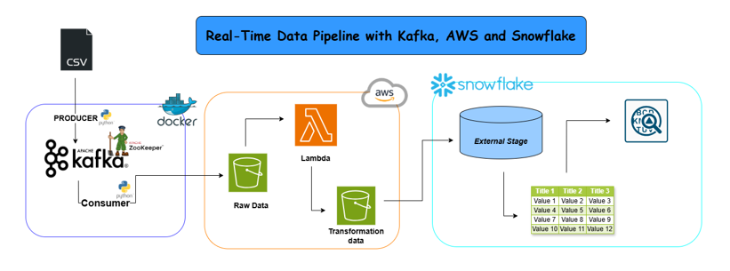

# Real-Time Data Pipeline Architecture

This diagram illustrates a real-time data pipeline that leverages Kafka, AWS, and Snowflake to process and store CSV data efficiently.

## Key Components:

- **CSV Data**: The pipeline begins with CSV data that needs to be processed.
  
- **Producer**: This component reads the CSV data and sends it to Kafka as messages.
  
- **Kafka**: Kafka acts as a distributed messaging system, ensuring reliable and scalable data ingestion.
  
- **Consumer**: This component consumes the messages from Kafka and passes them to the AWS Lambda function.
  
- **AWS Lambda**: The Lambda function is triggered by the incoming messages. It processes the raw data, performs transformations, and generates the final data.
  
- **Snowflake**: The transformed data is then written to Snowflake, a cloud-based data warehouse, for further analysis and reporting.

## Data Flow:

1. The **CSV data** is read by the producer and sent to Kafka as messages.
2. The **consumer** picks up these messages and passes them to the **AWS Lambda function**.
3. The **Lambda function** processes the raw data, applies transformations, and generates the final data.
4. The transformed data is written to **Snowflake**, where it can be queried and analyzed.

## Benefits:

- **Real-time Processing**: The pipeline processes data in real-time, enabling immediate insights and decision-making.
  
- **Scalability**: Kafka and AWS Lambda are highly scalable, allowing the pipeline to handle increasing data volumes.
  
- **Reliability**: Kafka ensures reliable message delivery, while Snowflake provides a durable and reliable data storage solution.
  
- **Flexibility**: The pipeline can be easily customized and extended to accommodate different data sources and processing requirements.

## Additional Considerations:

- **Error Handling**: Implement robust error handling mechanisms to ensure data integrity and recover from failures.
  
- **Security**: Implement appropriate security measures to protect sensitive data throughout the pipeline.
  
- **Monitoring and Logging**: Set up monitoring and logging tools to track pipeline performance and troubleshoot issues.

This real-time data pipeline provides a powerful and efficient way to process and store CSV data, enabling timely insights and data-driven decision-making.
