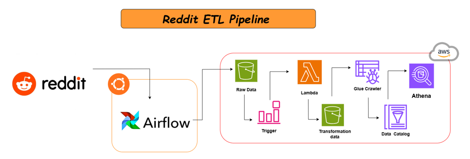

# Reddit ETL Pipeline



This repository contains a fully functional **Reddit ETL Pipeline** designed to extract, transform, and load data from Reddit to AWS services. The pipeline leverages modern tools like **Apache Airflow** for orchestration and **AWS services** for scalable data processing and querying.

## Project Overview

The Reddit ETL Pipeline follows these steps:

1. **Data Extraction**:  
   Data is fetched from Reddit using APIs and stored as raw data in Amazon S3.

2. **Orchestration with Airflow**:  
   Airflow is used to automate and trigger the pipeline tasks efficiently.

3. **Data Transformation**:  
   AWS Lambda functions process the raw data, cleaning and transforming it as per business requirements.

4. **Data Cataloging**:  
   AWS Glue Crawler updates the data catalog to prepare the data for querying.

5. **Querying with Athena**:  
   Transformed data is queried and analyzed using Amazon Athena.

## Key Components

- **Reddit**: Source of data.
- **Apache Airflow**: For orchestrating the ETL pipeline.
- **AWS Services**:
  - **S3**: Storage for raw and transformed data.
  - **Lambda**: For data processing and transformation.
  - **Glue Crawler**: To catalog the data.
  - **Athena**: For querying the processed data.

## How to Use

1. Clone the repository:
   ```bash
   git clone https://github.com/your-username/reddit-etl-pipeline.git
