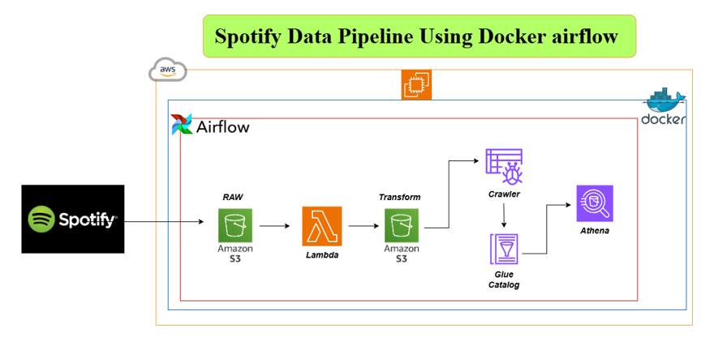

# Spotify Data Pipeline Using Docker Airflow

This project demonstrates the building of a data pipeline to process Spotify data using Dockerized Apache Airflow. The pipeline leverages various AWS services such as Amazon S3, AWS Lambda, AWS Glue, and Athena to process and analyze raw Spotify data. Below is a detailed breakdown of the pipeline.

## Architecture Diagram

## Components

1. **Spotify Data**: 
   - Raw data from Spotify is ingested into the pipeline.
   
2. **Amazon S3 (Raw)**: 
   - The raw data is first stored in an S3 bucket for processing.

3. **AWS Lambda (Transform)**: 
   - AWS Lambda functions are triggered to transform the raw data as per business logic. This transformation can involve cleaning, filtering, and aggregating the data.

4. **Amazon S3 (Transformed Data)**: 
   - The transformed data is stored back in an Amazon S3 bucket for further processing.

5. **AWS Glue Crawler**: 
   - The Glue Crawler is used to scan the transformed data stored in Amazon S3 and create a metadata catalog in AWS Glue.

6. **AWS Glue Catalog**: 
   - The metadata catalog stores the structure and schema of the transformed data, making it easier for other services like Athena to query the data.

7. **Amazon Athena**: 
   - Athena is used to query the transformed and cataloged data in Amazon S3 using SQL queries. This provides insights and reports for further analysis.

## Workflow

The workflow of the pipeline is as follows:

1. Spotify data is ingested and stored as raw data in an Amazon S3 bucket.
2. Airflow manages the orchestration of tasks.
3. AWS Lambda processes and transforms the raw data.
4. The transformed data is then stored in Amazon S3.
5. AWS Glue Crawler scans the transformed data, and the metadata is stored in the Glue Catalog.
6. Amazon Athena allows querying of the data directly from Amazon S3 using the Glue Catalog for schema information.

## Tools & Technologies

- **Docker**: Docker is used to containerize Apache Airflow, making it easy to deploy and manage workflows.
- **Apache Airflow**: Used for orchestrating and scheduling tasks in the pipeline.
- **AWS S3**: A scalable storage solution used to store raw and transformed data.
- **AWS Lambda**: A serverless compute service that processes the data.
- **AWS Glue**: Used for crawling data, cataloging, and data preparation.
- **Amazon Athena**: A serverless interactive query service used for querying the data.

## Benefits

- **Scalability**: The pipeline can scale easily with increasing data volume and complexity.
- **Serverless**: The serverless nature of AWS services like Lambda and Athena reduces the need for infrastructure management.
- **Cost-Efficiency**: Services are cost-effective and only incur charges when resources are used, making the pipeline highly cost-efficient.
