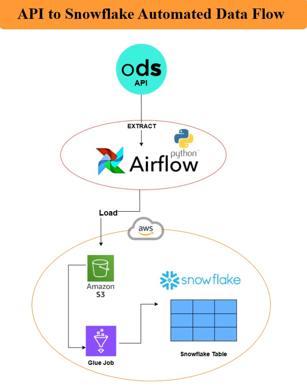

# ODS API to Snowflake Orchestrated ETL Pipeline

## Diagram

## Project Overview

This project demonstrates an end-to-end **ETL (Extract, Transform, Load)** pipeline designed to seamlessly transfer data from an **ODS API** to **Snowflake** for efficient storage and analysis. The pipeline leverages **Airflow** for orchestration, **AWS S3** for intermediate storage, and **AWS Glue** for data transformation, creating a scalable and automated data integration workflow.

---

## Key Components

1. **Data Source: ODS API**
   - Data is extracted from an Operational Data Store (ODS) API using Python scripts managed by Airflow.

2. **Orchestration: Apache Airflow**
   - Airflow automates the workflow by scheduling and monitoring the ETL processes, ensuring reliability and scalability.

3. **Intermediate Storage: AWS S3**
   - Extracted data is first stored in **Amazon S3** in a CSV format for further processing.

4. **Transformation: AWS Glue**
   - AWS Glue jobs are employed to perform data transformations and prepare it for loading into Snowflake.

5. **Data Warehouse: Snowflake**
   - The final transformed data is loaded into Snowflake tables for storage and subsequent analysis.

---

## Workflow

1. **Extract**:
   - Data is fetched from the ODS API using Python and is orchestrated by Airflow.
   
2. **Load to S3**:
   - Extracted data is stored in an S3 bucket for intermediate storage.

3. **Transform**:
   - AWS Glue processes the data, applying necessary transformations (e.g., filtering, renaming columns).

4. **Load to Snowflake**:
   - Transformed data is loaded into Snowflake tables using the Snowflake connector.

---

## Features

- **Automation**: Fully automated using Airflow for seamless execution of the ETL process.
- **Scalability**: AWS services and Snowflake enable high-performance data handling.
- **Flexibility**: Supports multiple data formats (e.g., CSV, JSON).
- **Reliability**: Airflow ensures task retries and error handling.
- **Modular Design**: Each component of the pipeline can be modified or scaled independently.

---

## Use Case

This pipeline is ideal for organizations looking to:
- Centralize API-based data into a data warehouse.
- Automate ETL processes for large-scale datasets.
- Use Snowflake for advanced analytics and reporting.

## Future Enhancements

- Support for additional data formats such as JSON and Parquet.
- Integration of advanced data quality checks.
- Monitoring and logging enhancements using Airflow’s built-in tools.
